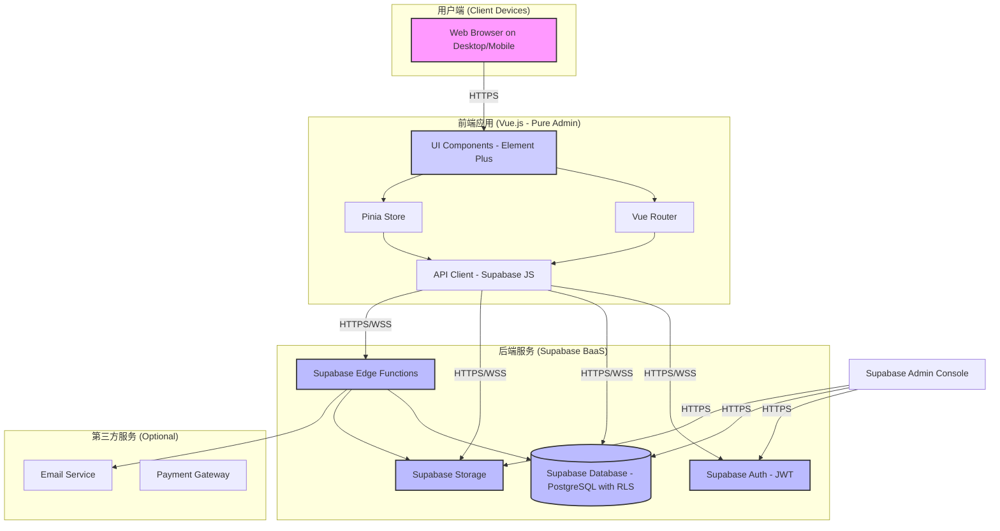
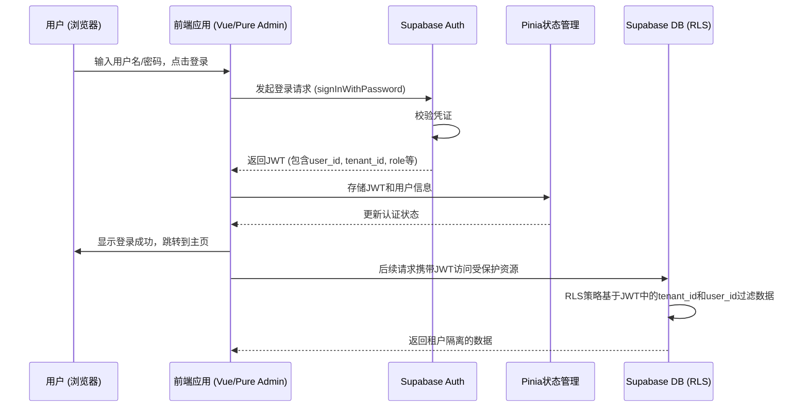
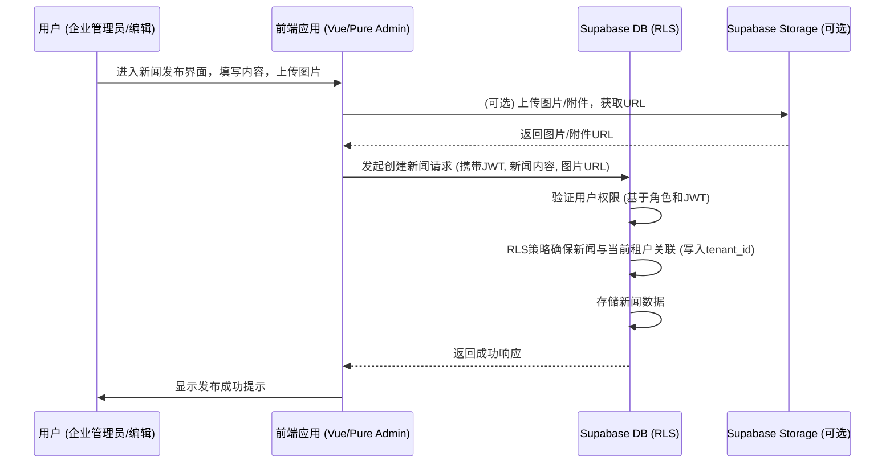

# 系统架构设计文档

## 1. 简介

本文档详细描述了企业级SaaS管理信息系统平台的总体架构设计。该平台旨在提供一个多租户的、可扩展的、安全的解决方案，以满足现代企业的综合管理需求，包括企业信息管理、新闻发布、人力资源、绩效评估和工作流审批等核心功能。

本文档的读者包括开发团队、测试团队、运维团队以及项目管理人员。

## 2. 架构目标

- **多租户支持：** 系统必须能够安全地隔离不同租户（企业客户）的数据和配置。
- **可扩展性：** 架构应支持水平扩展，以应对不断增长的用户量和数据量。
- **高可用性：** 系统核心功能应具备高可用性，减少单点故障。
- **安全性：** 严格遵循安全最佳实践，保护用户数据和系统完整性。
- **可维护性：** 模块化设计，代码清晰，易于理解、修改和维护。
- **灵活性：** 支持功能的模块化扩展和未来新需求的集成。
- **用户体验：** 提供流畅、一致且响应迅速的用户界面。

## 3. 系统概述

本平台采用基于 **Pure Admin 精简版** 的前端框架和 **Supabase** 作为后端即服务 (BaaS) 的现代Web应用架构。

- **前端 (Frontend):** Vue 3 + TypeScript，使用 Pinia 进行状态管理，Vue Router进行路由管理，Element Plus 作为UI组件库。
- **后端 (Backend):** Supabase 提供用户认证 (Auth)、数据库 (PostgreSQL)、对象存储 (Storage) 和边缘函数 (Edge Functions)。
- **多租户架构:** 主要通过 Supabase 的行级安全 (RLS)策略实现数据隔离。每个租户拥有独立的数据空间，并通过 JWT 中的租户信息进行识别和访问控制。

### 3.1 整体架构图



### 3.2 关键组件说明

1.  **前端应用 (Pure Admin Based):**
    *   **UI Components (Element Plus):** 提供丰富的预构建组件，加速界面开发。
    *   **Vue Router:** 管理单页应用的路由和导航。
    *   **Pinia Store:** 集中管理应用状态，包括用户信息、权限、租户信息等。
    *   **API Client (Supabase JS):** 封装与Supabase后端服务的交互逻辑。

2.  **后端服务 (Supabase):**
    *   **Supabase Auth:** 处理用户注册、登录、密码管理、JWT令牌签发和验证。JWT中将包含用户的`user_id`和`tenant_id`。
    *   **Supabase Database (PostgreSQL):** 存储所有应用数据，包括租户信息、用户信息、业务数据等。通过行级安全 (RLS) 策略实现数据隔离。
    *   **Supabase Storage:** 存储用户上传的文件，如文档、图片等。
    *   **Supabase Edge Functions:** 用于执行服务端逻辑，如复杂查询、数据校验、与第三方服务集成等，可以绕过RLS（在特定安全上下文中）或遵循RLS。

3.  **多租户实现:**
    *   **数据隔离:** 每个关键数据表将包含一个 `tenant_id` 列。RLS策略将确保用户只能访问其所属`tenant_id`的数据。
    *   **用户认证与租户关联:** 用户注册时或首次登录后，会被关联到一个特定的租户。用户的 JWT 令牌将包含 `tenant_id`，用于后续的 API 请求。
    *   **租户管理:** 可能需要一个超级管理员角色或特定的管理界面来创建和管理租户。

## 4. 模块架构

系统将按功能模块进行划分，每个模块负责特定的业务领域。

```mermaid
graph LR
    subgraph "企业级SaaS管理信息系统平台"
        A[系统基础架构]
        B[企业管理模块]
        C[新闻与信息管理模块]
        D[人力资源管理模块]
        E[绩效管理 (KPI) 模块]
        F[工作流管理模块]
    end

    A --> B
    A --> C
    A --> D
    A --> E
    A --> F

    B -.-> D
    D -.-> E
    F -.-> B
    F -.-> C
    F -.-> D
    F -.-> E

    %% Styling
    classDef module fill:#lightgrey,stroke:#333,stroke-width:2px
    class A,B,C,D,E,F module
```

### 4.1 模块说明

1.  **系统基础架构 (Epic 1):**
    *   搭建项目框架 (Pure Admin + Supabase)。
    *   实现多租户数据库模式 (RLS)。
    *   用户认证 (注册、登录、登出)。
    *   基础角色与权限管理框架。
    *   全局配置、日志、错误处理。

2.  **企业管理模块 (Epic 2):**
    *   租户 (企业) 注册、信息管理。
    *   企业管理员对本企业用户的管理 (增删改查、角色分配)。
    *   企业级配置 (如企业Logo、主题色等)。

3.  **新闻与信息管理模块 (Epic 3):**
    *   新闻/公告的创建、编辑、发布、删除。
    *   富文本编辑器支持。
    *   分类和标签管理。
    *   新闻列表展示、搜索、归档。

4.  **人力资源管理模块 (Epic 4):**
    *   员工档案管理 (个人信息、合同、部门、职位)。
    *   组织架构管理 (部门、职位层级)。
    *   工资项目管理。
    *   工资条生成与发放记录。
    *   HR相关文档管理。

5.  **绩效管理 (KPI) 模块 (Epic 5):**
    *   KPI模板定义与管理。
    *   绩效周期设置 (如月度、季度)。
    *   绩效评估流程 (自评、上级评审)。
    *   绩效结果跟踪与统计分析。

6.  **工作流管理模块 (Epic 6):**
    *   可视化表单设计器 (拖拽生成表单)。
    *   可视化工作流设计器 (定义审批节点、条件、负责人)。
    *   审批任务中心 (待办、已办)。
    *   审批流程跟踪与状态监控。
    *   通知系统 (邮件、站内信)。

## 5. 数据流

### 5.1 用户登录流程



### 5.2 新闻发布流程 (示例)



## 6. 技术选型理由

参考 `docs/tech-stack.md` 文档获取详细的技术选型理由。本架构主要基于项目需求文档 (`prd.md`) 中已明确的技术栈约束 (Pure Admin, Vue3, TypeScript, Supabase)。

- **Pure Admin (Thin Template):**
    - **优点:** 轻量级，包含基础的后台管理框架，集成Vue3, Vite, Element Plus, TypeScript，路由，权限控制等，加速开发启动。
    - **考虑:** 精简版可能需要根据SaaS特性进行定制和扩展。
- **Vue 3 & TypeScript:**
    - **优点:** Vue3 提供了更好的性能和组合式API；TypeScript 增强了代码的可维护性和健壮性，适合大型项目。
- **Supabase:**
    - **优点:** 提供了一体化的后端服务，简化了后端开发和部署。内置Auth, PostgreSQL, Storage, Edge Functions，非常适合快速原型和MVP开发。RLS是实现多租户数据隔离的强大特性。
    - **考虑:** 对于非常复杂或有特殊性能要求的场景，可能需要评估Supabase的限制。Edge Functions的冷启动和执行限制。

## 7. 非功能性需求实现策略

### 7.1 性能
- **前端:**
    - Vue 3 的性能优化。
    - Pure Admin 的按需加载和代码分割。
    - Element Plus 组件库的优化使用。
    - 懒加载、虚拟滚动等技术。
    - 静态资源CDN分发 (Supabase Storage 可配置CDN)。
- **后端 (Supabase):**
    - 优化的数据库查询和索引。
    - 合理使用 Edge Functions 避免不必要的计算。
    - Supabase 平台本身的性能保障。
- **目标:** 核心页面加载 < 2秒，并发操作响应迅速。

### 7.2 可扩展性
- **前端:** 模块化组件设计。
- **后端 (Supabase):**
    - Supabase自身支持一定程度的伸缩。
    - PostgreSQL 可以通过读写分离、分区等方式扩展 (需Supabase支持或自行管理)。
    - Edge Functions 可以独立部署和扩展。
    - 应用层面通过合理的模块化设计，未来可以将某些高负载模块拆分为独立微服务（如果超出Supabase能力）。
- **目标:** 支持100+企业同时在线，1000+用户并发。

### 7.3 可靠性/可用性
- **前端:** 优雅的错误处理和用户提示。
- **后端 (Supabase):**
    - Supabase 平台提供高可用性基础设施。
    - 定期数据库备份 (Supabase自动处理或可配置)。
    - 详细的日志记录 (应用层面和Supabase层面)。
- **目标:** 系统可用性 99.9%。

### 7.4 安全性
- **认证与授权:**
    - Supabase Auth 提供安全的JWT认证。
    - 基于角色的访问控制 (RBAC) 在前端和后端 (RLS, Edge Functions) 实施。
- **数据安全:**
    - **多租户数据隔离:** 核心机制，通过Supabase RLS实现。
    - **数据传输加密:** 全站 HTTPS。
    - **敏感数据处理:** 避免在前端存储敏感信息；必要时后端加密。
    - **防范常见Web攻击:** XSS, CSRF (Vue和Supabase有相应防护机制，需正确配置和使用)。
- **API安全:**
    - 所有API请求都需要有效JWT。
    - Edge Functions 进行输入验证。
- **基础设施安全:** 由Supabase平台负责。

### 7.5 可维护性
- **代码规范:** 遵循 `docs/coding-standards.md`。
- **模块化设计:** 低耦合、高内聚。
- **文档:** 完善的架构文档、API文档、代码注释。
- **测试:** 遵循 `docs/testing-strategy.md`，高单元测试覆盖率。

## 8. 部署架构

```mermaid
graph TD
    subgraph "开发流程"
        Developer[开发者本地环境] --> GitRepo[Git仓库 (e.g., GitHub, GitLab)]
    end

    subgraph "CI/CD Pipeline"
        GitRepo -- Webhook --> CICD[CI/CD服务 (e.g., GitHub Actions, Jenkins)]
        CICD --> Build[1. 构建前端资源]
        CICD --> Test[2. 运行测试]
        CICD --> DeployFE[3. 部署前端静态资源到Supabase Storage/Vercel/Netlify]
        CICD --> DeployBE[4. 部署Supabase Edge Functions]
        CICD --> DBMigrations[5. (可选)运行数据库迁移脚本]
    end

    subgraph "托管环境 (Supabase)"
        SupabaseProject[Supabase项目]
        SupabaseProject --> S_Auth[Auth]
        SupabaseProject --> S_DB[Database (PostgreSQL)]
        SupabaseProject --> S_Storage[Storage (托管前端静态资源)]
        SupabaseProject --> S_Functions[Edge Functions]
    end

    subgraph "用户访问"
        UserDevice[用户设备] -- HTTPS --> S_Storage_CDN[前端资源 (CDN)]
        UserDevice -- HTTPS/WSS --> S_Auth
        UserDevice -- HTTPS/WSS --> S_DB
        UserDevice -- HTTPS/WSS --> S_Functions
    end

    DeployFE --> S_Storage
    DeployBE --> S_Functions
    DBMigrations --> S_DB


    classDef dev fill:#ffe4b2,stroke:#333,stroke-width:2px
    class Developer,GitRepo dev

    classDef cicd fill:#b2f0ff,stroke:#333,stroke-width:2px
    class CICD,Build,Test,DeployFE,DeployBE,DBMigrations cicd

    classDef supahost fill:#d3ffd3,stroke:#333,stroke-width:2px
    class SupabaseProject,S_Auth,S_DB,S_Storage,S_Functions supahost

    classDef useraccess fill:#f9cbff,stroke:#333,stroke-width:2px
    class UserDevice,S_Storage_CDN useraccess
```

- **开发环境:** 开发者本地使用Node.js, Vite, Pure Admin CLI。连接到Supabase的开发实例。
- **代码仓库:** 使用Git进行版本控制。
- **CI/CD:**
    - 触发：代码推送到特定分支 (e.g., `main`, `develop`)。
    - 构建：Vite构建前端静态资源。
    - 测试：运行单元测试、集成测试。
    - 部署：
        - 前端静态资源：部署到Supabase Storage (配置为网站托管) 或 Vercel/Netlify 等静态托管平台，并通过CDN提供服务。
        - Supabase Edge Functions: 通过Supabase CLI或管理界面部署。
        - 数据库迁移: 使用Supabase的迁移工具或脚本执行。
- **环境分离:**
    - **开发 (Development):** 本地开发环境 + Supabase 开发项目。
    - **测试/预发布 (Staging):** 独立的Supabase项目，用于测试和验收。
    - **生产 (Production):** 独立的Supabase项目，面向最终用户。
    - 通过环境变量 (`.env` 文件或CI/CD配置) 管理不同环境的Supabase URL和API密钥。

## 9. 风险与缓解措施

| 风险点                                 | 可能性 | 影响度 | 缓解措施                                                                                                                               |
| :------------------------------------- | :----- | :----- | :------------------------------------------------------------------------------------------------------------------------------------- |
| **Supabase功能限制或性能瓶颈**        | 中     | 高     | 充分调研和测试Supabase能力；复杂逻辑优先使用Edge Functions；预留未来迁移到自建后端的可能性；优化数据库查询和设计。                               |
| **RLS策略配置复杂且易出错**           | 中     | 高     | 严格测试RLS策略；编写清晰的文档和测试用例；对开发人员进行RLS培训；使用视图或函数简化RLS。                                                     |
| **前端状态管理复杂性 (Pure Admin/Pinia)** | 中     | 中     | 遵循Pinia最佳实践；模块化Store设计；代码审查；保持状态定义清晰。                                                                        |
| **多租户场景下的安全漏洞**             | 低     | 高     | 严格执行RLS；定期安全审计；渗透测试；对用户输入进行严格校验；及时更新依赖库。                                                                 |
| **Edge Functions冷启动影响用户体验**  | 中     | 中     | 对于延迟敏感操作，评估是否适合Edge Functions；考虑预热机制 (如果Supabase支持)；优化函数执行效率。                                                |
| **Pure Admin模板定制工作量**          | 中     | 中     | 深入理解Pure Admin架构；优先使用其提供的扩展点；避免大规模魔改核心代码，优先通过组合和配置实现需求。                                                   |
| **团队对新技术栈 (Supabase) 的熟悉程度** | 中     | 中     | 提供培训资源；组织代码学习和分享会；鼓励小范围试验和原型验证。                                                                               |

## 10. 待定决策与未来考虑

- **具体CI/CD工具选型:** (e.g., GitHub Actions, GitLab CI, Jenkins) - *待定*
- **详细的日志聚合与监控方案:** (e.g., Sentry, Logtail, Supabase内置日志) - *待定*
- **邮件服务具体集成方案:** (e.g., Supabase内置, SendGrid, Mailgun) - *待定*
- **支付网关集成 (如果需要付费租户):** - *未来考虑*
- **高级数据分析和报表工具集成:** - *未来考虑*
- **全文搜索引擎集成 (若Supabase内置搜索不满足):** - *未来考虑*

## 11. 附录

- **术语表:** (后续补充)
- **参考资料:**
    - `docs/prd.md`
    - `docs/project-brief.md`
    - `docs/epic*.md`
    - Pure Admin 文档
    - Supabase 文档
    - Vue.js, Element Plus, Pinia 文档 