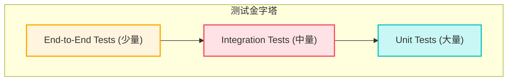

# 测试策略文档 (Testing Strategy)

## 1. 简介

本文档概述了企业级SaaS管理信息系统平台的测试策略。全面的测试是确保软件质量、可靠性、功能正确性以及用户满意度的关键。本策略涵盖了不同层级的测试，包括单元测试、集成测试和端到端 (E2E) 测试。

## 2. 测试目标

- **确保功能正确性:** 验证所有功能模块按照PRD和Epic描述正常工作。
- **保证数据完整性与安全:** 特别是多租户数据隔离和权限控制的正确性。
- **提升代码质量与可维护性:** 测试驱动开发 (TDD) 或行为驱动开发 (BDD) 的实践有助于设计出更健壮、更易于维护的代码。
- **减少回归缺陷:** 自动化测试套件能够在代码变更后快速发现回归问题。
- **加速交付周期:** 可靠的自动化测试减少了手动测试的负担，使得持续集成和持续交付 (CI/CD) 更加高效。
- **满足非功能性需求:** 验证性能、可用性等非功能性需求 (虽然本文档主要关注功能测试，但会提及性能和安全测试的切入点)。

## 3. 测试层级与范围

我们将采用测试金字塔模型，强调不同层级测试的比例和重要性。

### 3.1 单元测试 (Unit Tests)

- **范围:** 测试最小的可测试单元，如单个函数、方法、Vue组件的脚本部分 (Composition API逻辑)、Pinia store的actions/mutations/getters, Supabase Edge Function的独立逻辑单元。
- **目的:** 验证单元逻辑的正确性，隔离外部依赖。
- **工具:**
    - **前端 (Vue/TypeScript):** [Vitest](https://vitest.dev/) (与Vite集成良好，API类似Jest) 或 Jest。
    - **辅助库:** `@vue/test-utils` (用于Vue组件测试), `testing-library/vue` (提供更面向用户行为的组件测试API)。
    - **Supabase Edge Functions (Deno):** Deno内置的测试运行器 (`Deno.test`)。
- **关注点:**
    - 输入/输出验证。
    - 边界条件和异常处理。
    - Vue组件的props、emits、slots、生命周期钩子、组合式函数逻辑。
    - Pinia store的状态变更和getter计算。
- **模拟 (Mocking):**
    - 外部依赖 (如API调用, Supabase Client方法, Pinia store依赖, Vue Router) 应被模拟，以隔离测试单元。
    - Vitest/Jest提供强大的模拟功能。
- **目标覆盖率:** 核心业务逻辑和工具函数达到 **> 80%** 的代码行覆盖率。

### 3.2 集成测试 (Integration Tests)

- **范围:** 测试多个单元协同工作的场景。
    - **前端:**
        - 测试Vue组件与其子组件的交互。
        - 测试Vue组件与Pinia store的集成。
        - 测试Vue组件与Vue Router的集成。
        - 测试前端API模块 (`src/api/`) 与 Supabase JS Client 的模拟实例或真实 (测试环境) Supabase服务的交互 (需谨慎管理测试数据)。
    - **后端 (Supabase):**
        - 测试Edge Function与Supabase数据库的交互 (RLS策略的验证)。
        - 测试Edge Function之间的调用 (如果存在)。
        - 测试数据库的RLS策略、存储过程、触发器 (通过SQL脚本或特定测试工具)。
- **目的:** 验证组件间的接口和数据流是否正确，RLS策略是否按预期工作。
- **工具:**
    - **前端:** Vitest/Jest, `@vue/test-utils`, `testing-library/vue`。
    - **Supabase RLS/DB测试:** [pgTAP](https://pgtap.org/) (用于PostgreSQL的单元测试框架)，或编写SQL脚本结合Supabase CLI执行。
    - **Supabase Edge Functions:** Deno测试运行器，可能需要启动一个本地Supabase实例 (通过Supabase CLI `supabase start`) 并配置测试数据库。
- **关注点:**
    - 组件间的数据传递和事件处理。
    - 状态管理与组件的正确同步。
    - 路由导航和参数传递。
    - API请求和响应的正确处理 (包括错误情况)。
    - RLS策略对数据访问的正确限制。
- **目标覆盖率:** 关键业务流程和组件交互达到 **> 60%** 的覆盖率。

### 3.3 端到端测试 (End-to-End Tests - E2E)

- **范围:** 从用户视角出发，模拟真实用户在浏览器中操作应用的完整流程。测试整个应用栈 (前端UI -> API -> Supabase后端 -> 数据库)。
- **目的:** 验证用户核心路径和关键业务流程是否按预期工作，确保系统作为一个整体的正确性。
- **工具:**
    - [Cypress](https://www.cypress.io/) 或 [Playwright](https://playwright.dev/)。
    - Pure Admin模板可能已集成或推荐特定E2E测试工具。
- **关注点:**
    - 用户注册、登录、登出流程。
    - 核心模块的CRUD操作 (例如，新闻发布、员工管理、发起审批)。
    - 跨多个页面的用户旅程。
    - 多租户场景下的基本隔离验证 (例如，用户A无法看到用户B的数据)。
    - UI元素的可见性、可交互性和正确性。
- **环境:** E2E测试通常在部署到Staging环境 (一个与生产环境配置相似的完整测试环境) 的应用上运行。
- **数据管理:** 需要策略来管理E2E测试的测试数据 (例如，测试前数据准备，测试后数据清理)。
- **目标覆盖率:** 覆盖所有核心用户场景和关键业务流程。由于E2E测试运行较慢且维护成本较高，数量上会远少于单元和集成测试，但其覆盖的场景价值很高。

## 4. 特殊场景测试

### 4.1 Supabase RLS (行级安全) 测试

- 这是本SaaS应用安全的核心，需要重点测试。
- **方法:**
    - 使用pgTAP编写针对PostgreSQL的单元测试，直接测试RLS策略的SQL逻辑。
    - 在集成测试中，使用不同的模拟用户身份 (不同`tenant_id`，不同角色) 调用Supabase JS Client的方法，验证其只能访问/修改预期的数据。
    - 在E2E测试中，设计跨租户访问的场景来验证隔离性。

### 4.2 权限测试

- 验证基于角色的访问控制 (RBAC) 是否正确。
- **方法:**
    - **单元/集成测试:** 测试前端路由守卫、组件内权限判断逻辑、Pinia store中权限状态的管理。
    - **集成测试:** 测试Edge Function中基于角色的权限检查逻辑。
    - **E2E测试:** 以不同角色用户登录，验证其UI可见性、操作权限是否符合预期。

### 4.3 响应式设计与跨浏览器测试

- **范围:** 验证应用在不同设备尺寸 (桌面、平板、手机) 和主流现代浏览器 (Chrome, Firefox, Safari, Edge) 上的兼容性和显示效果。
- **工具:**
    - 浏览器开发者工具的设备模拟功能。
    - E2E测试工具 (Cypress, Playwright) 支持在不同浏览器和视口尺寸下运行测试。
    - (可选) 云测试平台如BrowserStack, Sauce Labs。
- **策略:** 主要通过E2E测试覆盖，并辅以手动检查。

### 4.4 性能测试 (初步)

- **范围:** 针对关键API接口和页面加载时间进行基础性能评估。
- **工具:**
    - 浏览器开发者工具 (Lighthouse, Network tab)。
    - (可选) k6, JMeter等负载测试工具。
- **策略:** 在开发过程中关注性能指标，PRD中定义了性能目标 (如页面加载<2s)。CI/CD流程中可以集成Lighthouse进行性能评分。专门的负载测试和压力测试可能在后续阶段进行。

### 4.5 安全测试 (初步)

- **范围:** 基础的安全性检查，如XSS, CSRF防护，数据传输加密 (HTTPS)。
- **策略:**
    - 遵循安全编码实践 (参考`coding-standards.md`)。
    - Supabase和Vue/Pure Admin本身提供了一些安全机制。
    - 代码审查关注安全风险点。
    - (可选) 后续可引入自动化安全扫描工具或进行渗透测试。

## 5. 测试数据管理

- **单元测试:** 通常使用模拟数据或小规模的固定数据。
- **集成测试:** 可能需要更真实的模拟数据。对于与真实Supabase实例的集成测试，需要一套可重复创建和清理的测试数据集。
- **E2E测试:** 需要稳定的测试环境和可控的测试数据。考虑数据生成脚本、数据匿名化、测试后数据回滚或清理机制。
- **数据库Seeding:** 在 `supabase/seed.sql` (如果使用Supabase CLI本地开发) 或通过脚本为开发和测试环境填充初始数据。

## 6. 测试执行与自动化

- **本地开发:** 开发者在本地运行单元测试和相关集成测试，确保代码提交前通过测试。
- **Git Hooks:** 使用 pre-commit 钩子 (如Husky + lint-staged) 在提交前自动运行Linters和单元测试。
- **CI/CD 集成:**
    - 在CI/CD流水线中自动执行所有层级的自动化测试 (单元、集成、E2E)。
    - 测试失败应阻止代码合并或部署。
    - 定期生成测试覆盖率报告 (如使用Vitest的c8或nyc)。
- **测试报告:** CI/CD流程应生成易于阅读的测试报告，方便快速定位失败原因。

## 7. 缺陷管理

- 使用项目管理工具 (如Jira, GitHub Issues) 跟踪和管理发现的缺陷。
- 缺陷应包含清晰的复现步骤、预期结果、实际结果、环境信息和严重级别。
- 修复后的缺陷需要经过回归测试验证。

## 8. 角色与职责

- **开发者:** 负责编写单元测试和部分集成测试，确保其代码质量。
- **QA工程师 (如果设立):** 负责设计和执行E2E测试，管理测试计划和测试用例，进行探索性测试。
- **架构师/技术负责人:** 制定和维护测试策略，确保测试覆盖关键风险点。
- **整个团队:** 共同对产品质量负责，积极参与代码审查和测试讨论。

本文档为测试策略的初始版本，将根据项目的进展和团队的反馈进行调整和完善。 